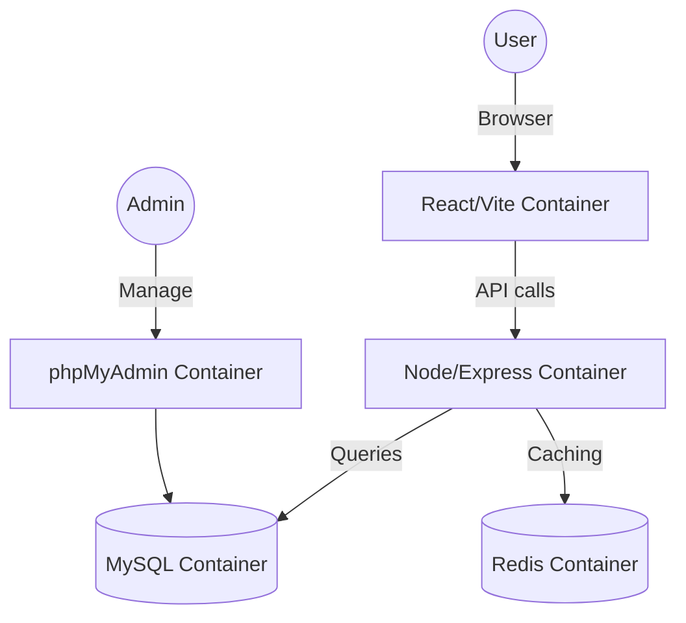

# Billing-V2: Full-Stack Dockerized Billing & POS System

A production-ready, highly automated billing and Point of Sale (POS) ecosystem built with modern technologies and a robust Docker infrastructure.

## 🚀 Tech Stack

### Frontend
- **React 18** (Vite)
- **Vanilla CSS / Tailwind CSS**
- **State Management**: React Hooks
- **Environment Management**: Dynamic switching via `web/src/config/index.ts`

### Backend
- **Node.js & Express** (TypeScript)
- **Database**: Prisma ORM with MySQL 8.0
- **Caching**: Redis
- **Automation**: Custom Bash entrypoints for database health checks and migrations

### Infrastructure
- **Docker & Docker Compose**
- **phpMyAdmin**: Managed database interface on port `8081`
- **Networking**: Isolated internal bridge network

---

## 🛠️ Quick Start

### 1. Prerequisites
- Docker & Docker Compose installed
- Node.js (v18+) installed locally (for linting/IDE support)

### 2. Initialization
Run the management script to set up your environment variables and start the containers:
```bash
npm run docker:dev
```
*Wait for the CLI prompt to create your `.env` file if it doesn't exist.*

### 3. Access the Services
- **Frontend**: [http://localhost:5173](http://localhost:5173)
- **Backend API**: [http://localhost:5000](http://localhost:5000)
- **phpMyAdmin**: [http://localhost:8081](http://localhost:8081)

---

## 📂 Environment Management

This project uses a consolidated environment strategy.

- **Root `.env`**: Contains shared secrets and database credentials for Docker.
- **Web `.env`**: Located in `web/`. Contains both Development and Production variables (e.g., `VITE_DEV_API_URL` and `VITE_PROD_API_URL`).
- **Backend Envs**: Located in `server/` (e.g., `.env.development`, `.env.production`).

---

## ✅ Best Practices (Do's and Don'ts)

### 👍 Do's
- **Use `npm run docker:dev`**: Always use the provided script to start the project. It ensures environment variables are synced.
- **Save Schema Changes**: After modifying `server/prisma/schema.prisma`, the backend container will automatically apply changes using `prisma db push` during development.
- **Git Hygiene**: Run `scripts/manage.sh` before pushing to ensure `.env` files are in place.

### ❌ Don'ts
- **DON'T Change NODE_ENV in Docker Compose**: For the development server to work (with Hot Reloading), the frontend `NODE_ENV` must stay as `development`.
- **DON'T Hardcode URLs**: Always use the configuration loader in `web/src/config/index.ts` or `server/src/config/index.ts`.
- **DON'T Delete Volumes**: Database data is persistent in the `mysql_data` volume. Use `docker-compose down -v` only if you want to wipe the database.

---

## 🏗️ Architecture



---

## 📜 Available Scripts

| Script | Description |
| :--- | :--- |
| `npm run docker:dev` | Starts the full stack in development mode with hot-reloading. |
| `npm run docker:prod` | Starts the project in production mode. |
| `prisma db push` | (Inside container) Syncs schema without losing development data. |
